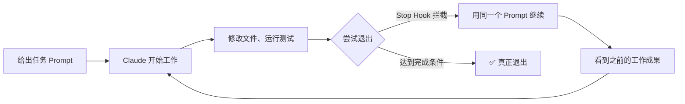
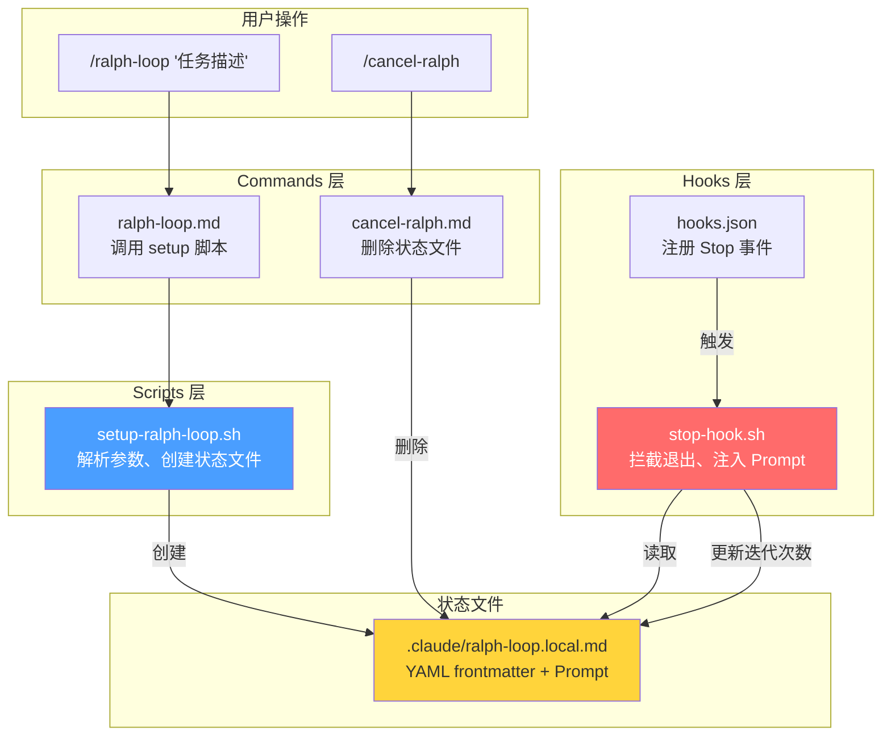
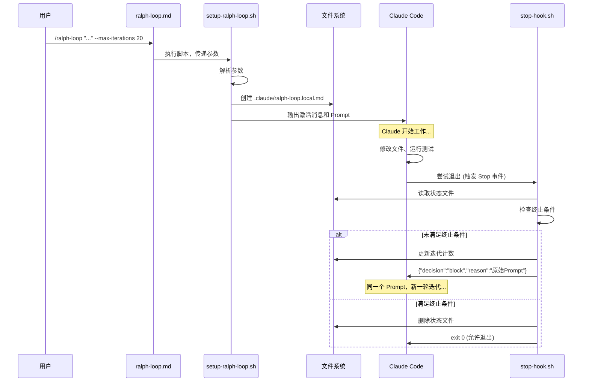
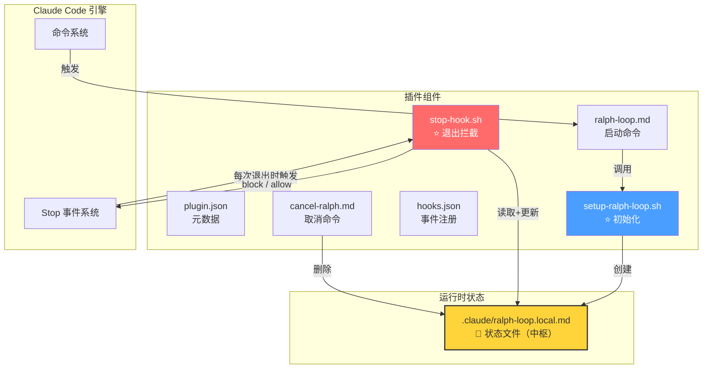

# 🧠 Ralph Wiggum 插件深度学习指南

> [!NOTE]
> 本指南将带你从**概念理解 → 架构拆解 → 源码精读 → 运行机制模拟 → 实战应用**，逐层深入理解这个有趣的迭代开发插件。

---

## 📚 目录导航

| 阶段 | 主题 | 难度 |
|------|------|------|
| **第 1 课** | 理念：什么是 Ralph？为什么叫这个名字？ | ⭐ |
| **第 2 课** | 架构：插件的文件组织与组件关系 | ⭐⭐ |
| **第 3 课** | 核心机制：Stop Hook 是如何劫持退出的？ | ⭐⭐⭐ |
| **第 4 课** | 启动流程：从 `/ralph-loop` 到循环开始 | ⭐⭐⭐ |
| **第 5 课** | 完整生命周期：一次循环从创建到完成 | ⭐⭐⭐⭐ |
| **第 6 课** | 实战：如何写好 Ralph Prompt | ⭐⭐ |

---

## 第 1 课 — 理念：什么是 Ralph Wiggum？

### 🎬 背景故事

Ralph Wiggum 是《辛普森一家》中的角色，以"不管什么情况都坚持不懈"著称。这个插件的名字正是取自这种**"坚持到底"**的精神。

技术方法论源自 **Geoffrey Huntley** 提出的 Ralph 技术：

```bash
# 原始的 Ralph 概念 — 就是一个 Bash 死循环
while :; do
  cat PROMPT.md | claude-code --continue
done
```

### 💡 核心思想

传统方式：你给 AI 一个任务 → AI 完成一次 → 结束

Ralph 方式：你给 AI **同一个任务** → AI 完成一次 → **自动再来一次** → 看到上次的成果 → 继续改进 → 循环直到完美



### 🔑 关键洞察

| 概念 | 解释 |
|------|------|
| **自引用** (Self-referential) | Claude 不是"读取自己的输出"，而是**通过文件系统和 git 历史**看到自己之前的工作 |
| **确定性差** (Deterministically bad) | 失败是可预测的、有信息量的，可以用来调优 prompt |
| **操作者技能** | 成功取决于写好 prompt，而不仅仅是模型能力 |
| **迭代 > 完美** | 不追求一次做对，让循环来打磨结果 |

---

## 第 2 课 — 架构：文件组织与组件关系

### 📁 完整文件树

```
ralph-wiggum/
├── .claude-plugin/
│   └── plugin.json              ← 插件元数据（名称、版本、作者）
├── commands/
│   ├── ralph-loop.md            ← /ralph-loop 命令定义
│   ├── cancel-ralph.md          ← /cancel-ralph 命令定义
│   └── help.md                  ← /help 命令定义
├── hooks/
│   ├── hooks.json               ← Hook 注册配置
│   └── stop-hook.sh             ← ⭐ 核心：Stop 事件处理脚本
├── scripts/
│   └── setup-ralph-loop.sh      ← ⭐ 核心：循环初始化脚本
└── README.md                    ← 插件文档
```

### 🔗 组件关系图



> [!IMPORTANT]
> **状态文件 `.claude/ralph-loop.local.md` 是整个系统的"中枢"** — setup 脚本创建它，stop-hook 读取和更新它，cancel 命令删除它。它的存在与否决定了循环是否活跃。

---

## 第 3 课 — 核心机制：Stop Hook 如何劫持退出

这是整个插件最精妙的部分。让我们逐段拆解 [stop-hook.sh](file:///d:/project/AI/github-project/claude-code/plugins/ralph-wiggum/hooks/stop-hook.sh)。

### Step 1：Hook 注册

[hooks.json](file:///d:/project/AI/github-project/claude-code/plugins/ralph-wiggum/hooks/hooks.json) 只做一件事 — 在 `Stop` 事件上注册脚本：

```json
{
  "hooks": {
    "Stop": [{
      "hooks": [{
        "type": "command",
        "command": "${CLAUDE_PLUGIN_ROOT}/hooks/stop-hook.sh"
      }]
    }]
  }
}
```

> `Stop` 事件在 Claude 每次**尝试结束当前会话/轮次**时触发。

### Step 2：检查循环是否激活

```bash
RALPH_STATE_FILE=".claude/ralph-loop.local.md"

if [[ ! -f "$RALPH_STATE_FILE" ]]; then
  exit 0   # 没有状态文件 → 不拦截，正常退出
fi
```

💡 **设计精妙之处**：通过文件存在性来判断是否激活，极其简洁。

### Step 3：解析状态文件的 YAML Frontmatter

```bash
FRONTMATTER=$(sed -n '/^---$/,/^---$/{ /^---$/d; p; }' "$RALPH_STATE_FILE")
ITERATION=$(echo "$FRONTMATTER" | grep '^iteration:' | sed 's/iteration: *//')
MAX_ITERATIONS=$(echo "$FRONTMATTER" | grep '^max_iterations:' | sed 's/max_iterations: *//')
COMPLETION_PROMISE=$(echo "$FRONTMATTER" | grep '^completion_promise:' | sed 's/completion_promise: *//' | sed 's/^"\(.*\)"$/\1/')
```

状态文件长这样：
```markdown
---
active: true
iteration: 3
max_iterations: 20
completion_promise: "DONE"
started_at: "2026-04-12T15:00:00Z"
---

Build a REST API for todos...
```

### Step 4：终止条件检查

````carousel
**条件 A：达到最大迭代次数**
```bash
if [[ $MAX_ITERATIONS -gt 0 ]] && [[ $ITERATION -ge $MAX_ITERATIONS ]]; then
  echo "🛑 Ralph loop: Max iterations ($MAX_ITERATIONS) reached."
  rm "$RALPH_STATE_FILE"
  exit 0          # 删除状态文件，允许退出
fi
```
<!-- slide -->
**条件 B：检测到完成承诺 (Completion Promise)**
```bash
# 从 Claude 最后的输出中提取 <promise>标签内的文本
PROMISE_TEXT=$(echo "$LAST_OUTPUT" | perl -0777 -pe \
  's/.*?<promise>(.*?)<\/promise>.*/$1/s; s/^\s+|\s+$//g; s/\s+/ /g')

# 精确匹配（不是模式匹配）
if [[ -n "$PROMISE_TEXT" ]] && [[ "$PROMISE_TEXT" = "$COMPLETION_PROMISE" ]]; then
  echo "✅ Ralph loop: Detected <promise>$COMPLETION_PROMISE</promise>"
  rm "$RALPH_STATE_FILE"
  exit 0          # 完成了！允许退出
fi
```
<!-- slide -->
**条件 C：各种异常情况（状态文件损坏、转录文件丢失等）**
```bash
# 数值校验失败
if [[ ! "$ITERATION" =~ ^[0-9]+$ ]]; then
  echo "⚠️  Ralph loop: State file corrupted"
  rm "$RALPH_STATE_FILE"
  exit 0          # 安全退出
fi
# 以及其他 5 种异常检查...
```
````

### Step 5：继续循环 — 核心输出 ⭐

如果没有满足任何终止条件，脚本输出一个 **JSON 决策**来阻止退出并注入新 prompt：

```bash
NEXT_ITERATION=$((ITERATION + 1))

# 从状态文件中提取原始 prompt（--- 之后的内容）
PROMPT_TEXT=$(awk '/^---$/{i++; next} i>=2' "$RALPH_STATE_FILE")

# 更新迭代计数
sed "s/^iteration: .*/iteration: $NEXT_ITERATION/" "$RALPH_STATE_FILE" > "${RALPH_STATE_FILE}.tmp.$$"
mv "${RALPH_STATE_FILE}.tmp.$$" "$RALPH_STATE_FILE"

# 输出 JSON — 这是魔法发生的地方！
jq -n \
  --arg prompt "$PROMPT_TEXT" \
  --arg msg "🔄 Ralph iteration $NEXT_ITERATION | ..." \
  '{
    "decision": "block",       ← 阻止退出！
    "reason": $prompt,         ← 把原始 prompt 重新喂给 Claude
    "systemMessage": $msg      ← 显示迭代信息
  }'
```

> [!IMPORTANT]
> **`"decision": "block"` 是整个插件的灵魂** — 它告诉 Claude Code："不要退出，这是你下一轮应该做的事情（reason）"。Claude Code 的 Stop Hook API 看到 `block` 后，会把 `reason` 作为新的 prompt 输入，从而实现了循环。

---

## 第 4 课 — 启动流程：从 `/ralph-loop` 到循环开始

### 用户输入

```bash
/ralph-loop "Build a todo API" --completion-promise "DONE" --max-iterations 20
```

### 执行链路



### [setup-ralph-loop.sh](file:///d:/project/AI/github-project/claude-code/plugins/ralph-wiggum/scripts/setup-ralph-loop.sh) 关键逻辑

```bash
# 1. 参数解析（支持灵活的顺序）
#    无引号的多个词会自动拼接为 prompt
PROMPT_PARTS=()
while [[ $# -gt 0 ]]; do
  case $1 in
    --max-iterations)  MAX_ITERATIONS="$2"; shift 2 ;;
    --completion-promise)  COMPLETION_PROMISE="$2"; shift 2 ;;
    *)  PROMPT_PARTS+=("$1"); shift ;;   # 非选项参数收集为 prompt
  esac
done
PROMPT="${PROMPT_PARTS[*]}"

# 2. 创建状态文件（Markdown + YAML frontmatter 格式）
cat > .claude/ralph-loop.local.md <<EOF
---
active: true
iteration: 1
max_iterations: $MAX_ITERATIONS
completion_promise: $COMPLETION_PROMISE_YAML
started_at: "$(date -u +%Y-%m-%dT%H:%M:%SZ)"
---

$PROMPT
EOF
```

> [!TIP]
> 注意状态文件使用了 `.local.md` 后缀 — 这遵循 Claude Code 的约定，`.local` 文件通常被 gitignore，不会被提交到仓库。

---

## 第 5 课 — 完整生命周期模拟

让我们完整模拟一次 ralph-loop 的生命周期：

### 🎬 场景：修复一个 auth bug

```
/ralph-loop "修复 auth.ts 中的 token 刷新逻辑。运行测试确认。完成后输出 <promise>FIXED</promise>" --completion-promise "FIXED" --max-iterations 10
```

````carousel
### 迭代 1 — 首次尝试

**状态文件：**
```yaml
iteration: 1
max_iterations: 10
completion_promise: "FIXED"
```

**Claude 的行为：**
1. 读取 auth.ts，理解 token 刷新逻辑
2. 发现 refresh token 过期没有正确处理
3. 修改代码
4. 运行测试 → 3/5 通过，2 个失败
5. 准备退出

**Stop Hook 判断：**
- 没有检测到 `<promise>FIXED</promise>` → `block`
- 迭代 1 < 10 → 继续

<!-- slide -->
### 迭代 2 — 看到上次的工作

**状态文件：**
```yaml
iteration: 2
```

**Claude 的行为：**
1. 收到同一个 prompt
2. 检查文件 → 发现上次已修改过 auth.ts
3. 运行测试 → 看到 2 个失败的具体原因
4. 修复 edge case
5. 运行测试 → 4/5 通过
6. 准备退出

**Stop Hook 判断：**
- 没有 `<promise>FIXED</promise>` → 继续

<!-- slide -->
### 迭代 3 — 最终成功 ✅

**状态文件：**
```yaml
iteration: 3
```

**Claude 的行为：**
1. 收到同一个 prompt
2. 检查文件 → 上次修复了 edge case
3. 运行测试 → 看到最后 1 个失败
4. 修复最后的问题
5. 运行测试 → **5/5 全部通过** ✅
6. 输出：`<promise>FIXED</promise>`

**Stop Hook 判断：**
- ✅ 检测到 `<promise>FIXED</promise>` 匹配 → 删除状态文件 → 允许退出

```
✅ Ralph loop: Detected <promise>FIXED</promise>
```
````

### 🧩 为什么这能工作？

| 每次迭代 Claude 能看到的 | 来源 |
|---|---|
| **相同的任务描述** | Stop Hook 从状态文件重新注入的 |
| **已修改的源文件** | 上次迭代写入磁盘的 |
| **测试结果** | 每次重新运行测试获得的 |
| **git diff** | git 自动记录的文件变化 |
| **之前的对话上下文** | 同一个 session，上下文保留 |

---

## 第 6 课 — 实战：如何写好 Ralph Prompt

### ❌ 反面教材

```bash
# 太模糊，没有完成标准
/ralph-loop "把代码写好"

# 没有自动验证手段
/ralph-loop "设计一个漂亮的 UI"

# 没有设置安全边界（可能无限循环！）
/ralph-loop "实现一个复杂功能"
```

### ✅ 好的 Prompt 模板

```bash
/ralph-loop "
## 任务
[具体、明确的任务描述]

## 验证方法
1. 运行 npm test — 所有测试必须通过
2. 运行 npm run lint — 无 lint 错误
3. [其他可自动验证的条件]

## 分阶段目标
Phase 1: [第一步]
Phase 2: [第二步]
Phase 3: [第三步]

## 完成条件
当以上所有条件满足时，输出 <promise>COMPLETE</promise>

## 如果卡住
- 记录遇到的障碍
- 尝试替代方案
- 继续迭代
" --completion-promise "COMPLETE" --max-iterations 30
```

### 🎯 Prompt 设计的 4 个关键原则

| 原则 | 说明 | 例子 |
|------|------|------|
| **可测量的完成标准** | 不依赖人工判断 | "所有测试通过" 而不是 "代码质量好" |
| **增量目标** | 分解为可独立验证的阶段 | Phase 1 → Phase 2 → Phase 3 |
| **自动验证** | 每次迭代能自动检查进度 | `npm test`, `npm run lint` |
| **安全边界** | 始终设置 `--max-iterations` | `--max-iterations 20` |

---

## 🗺️ 总结：一张图看懂全局



> [!TIP]
> **整个插件的设计模式可以概括为一句话**：用一个**状态文件**作为"循环存在"的标志，一个 **Stop Hook** 在每次退出时检查状态文件，如果存在就 `block` 退出并重新注入 prompt —— 仅此而已，极其简洁优雅。
